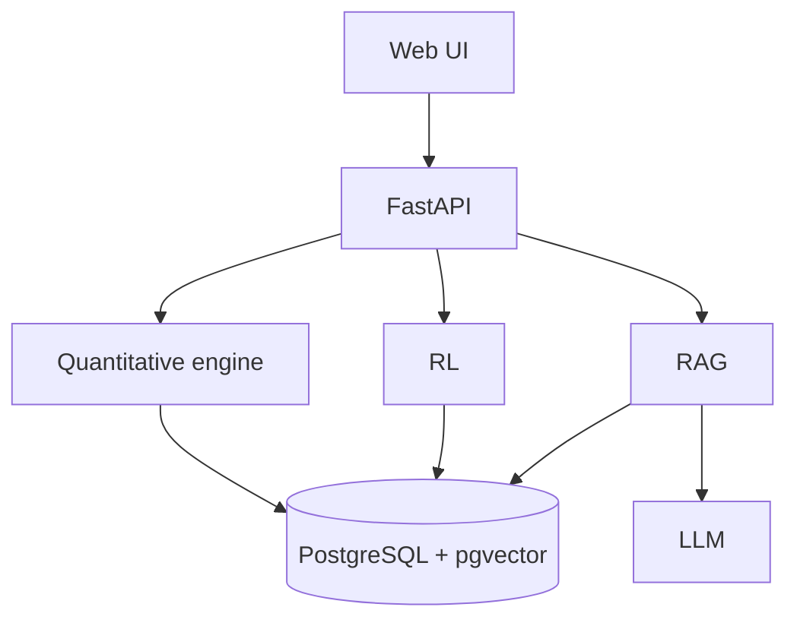

# Portfolio Master

A quantitative investment research and portfolio-management platform combining classical
portfolio theory, risk analytics, historical backtesting, reinforcement learning, and
AI-assisted financial-document research.

This repository is `portfolio_master`. The product display name is **Portfolio Master**.

## Project purpose

The long-term system is a professional research workbench, not a toy optimizer and not an
"AI picks stocks" demo.

It is designed for:

- Classical quantitative portfolio construction and risk analysis
- Chronological backtesting with explicit transaction assumptions
- Reinforcement-learning portfolio agents evaluated against classical benchmarks
- Retrieval-augmented research over actual financial documents
- An LLM copilot that explains engine output and retrieved evidence

Target discussion contexts include quantitative research, portfolio analytics, risk,
systematic investing, and Python/AI engineering in finance.

## Current status

**Stage 1A — project architecture and development environment.**

The repository now has a reproducible backend foundation, a minimal React shell, PostgreSQL
+ pgvector infrastructure via Docker Compose, and architecture documentation.

Stage 1A does **not** contain the quantitative investment engine. There is no market-data
ingestion, no optimizer, no risk formulas, no backtester, no RL agent, and no RAG/LLM
pipeline.

## Final architecture overview

A modular monolith:

1. React / TypeScript UI
2. FastAPI application with a `/api` namespace
3. Deterministic quantitative packages (`quant`, `portfolio`, `risk`, `optimization`, `backtest`)
4. Separate RL package for sequential decisions
5. RAG + LLM packages for retrieval and explanation
6. PostgreSQL + pgvector as the only data store

The LLM is never the source of truth for numbers. RAG never modifies portfolio weights.
Details: [docs/architecture/system-architecture.md](docs/architecture/system-architecture.md)
and [docs/architecture/module-boundaries.md](docs/architecture/module-boundaries.md).



## Technology stack

| Layer | Choice | Role now |
| --- | --- | --- |
| Backend | Python 3.11+, FastAPI, Pydantic, uvicorn | HTTP foundation |
| Config | pydantic-settings, `.env` | Environment-based configuration |
| Frontend | Vite, React, TypeScript | Minimal professional shell |
| Database | PostgreSQL with pgvector image | Infrastructure only; no app schema yet |
| Packaging | Docker Compose + backend Dockerfile | Dev database; optional API container |
| Tests | pytest, pytest-cov, httpx | Health and configuration tests |
| Lint | Ruff | Backend style |

NumPy, Pandas, CVXPY, RL libraries, and LLM/embedding SDKs are intentionally **not**
installed yet.

## Repository structure

```
backend/                 FastAPI application and tests
frontend/                Vite + React + TypeScript shell
docs/                    Architecture and development documentation
data/                    Reserved for market data (not ingested in Stage 1A)
notebooks/               Exploration only
scripts/                 Reserved for later operational scripts
docker-compose.yml       PostgreSQL + pgvector (optional API profile)
.env.example             Configuration template
```

## Stage roadmap

The project is developed incrementally. See
[docs/development/development-roadmap.md](docs/development/development-roadmap.md).

| Stage | Focus |
| --- | --- |
| 1 | Architecture and environment (current) |
| 2–7 | Data, analytics, risk, optimization, backtesting |
| 8–10 | Domain APIs, dashboard, interactive recalculation |
| 11–14 | RL environment, agent, evaluation vs classical strategies |
| 15–19 | Documents, pgvector, RAG, research copilot |
| 20–27 | Reports, testing, performance, Docker, docs, presentation |

## Local development prerequisites

- Python 3.11+
- Node.js 20+
- Docker Desktop if you want PostgreSQL running locally

Full commands: [docs/development/local-setup.md](docs/development/local-setup.md).

### One-shot backend setup

From the repository root (Ghostty / zsh):

```bash
python3 -m venv backend/.venv && source backend/.venv/bin/activate && python -m pip install --upgrade pip && python -m pip install -e "./backend[dev]" && (test -f .env || cp .env.example .env) && cd backend && python -m pytest
```

## Backend setup

```bash
source backend/.venv/bin/activate
cd backend
python -m uvicorn app.main:app --reload --host 0.0.0.0 --port 8000
```

- http://127.0.0.1:8000/health
- http://127.0.0.1:8000/api/health
- http://127.0.0.1:8000/docs

## Frontend setup

```bash
cd frontend
npm install
npm run dev
```

Build check:

```bash
cd frontend && npm run build
```

The Stage 1A UI does not load portfolios or charts.

## Database / Docker setup

```bash
docker compose up -d postgres
docker compose config
```

Optional API container:

```bash
docker compose --profile api up --build
```

Compose uses development credentials from `.env` / `.env.example`. This is not a
production deployment.

## Testing

From `backend/` with the virtualenv active:

```bash
python -m pytest
python -m pytest --cov=app --cov-report=term-missing
```

From the repository root:

```bash
python -m pytest
```

## Environment configuration

Copy `.env.example` to `.env`. Required to start Postgres via Compose: `POSTGRES_*`.
Application fields have code defaults. There are no vendor API keys in Stage 1A.

## Current limitations

- No market data and no vendor integrations
- No portfolio math
- No persistence schema
- No authentication
- No WebSockets
- Frontend is a shell
- Docker is development infrastructure, not a hardened production stack
- Backtested performance will never be claimed as live performance

## Development philosophy

Correctness, financial validity, reproducibility, explainability, and tests outrank adding
frameworks. Principles:
[docs/development/development-principles.md](docs/development/development-principles.md).

This project is being developed incrementally. Stage 1 does not contain the quantitative
investment engine yet.
