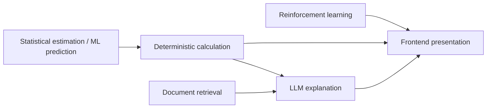

# Module Boundaries

This document is the ownership map for Portfolio Master. If a feature does not have a
clear owner below, it is not ready to implement.

## Separation of concerns

| Layer | Owns | Must never |
| --- | --- | --- |
| Deterministic quantitative calculations | Algebraic identities given inputs (portfolio variance, risk contribution, backtest P&L given trades) | Call an LLM to "estimate" a metric |
| Estimation / prediction | Expected returns, covariance estimates, optional ML forecasts | Silently use future data; overwrite realized history |
| Reinforcement learning | Policy that maps state to portfolio actions | Be the only allocator; skip classical benchmarks |
| Document retrieval | Chunk selection with metadata | Change weights; answer without sources |
| LLM explanation | Language over provided numbers and passages | Invent metrics, citations, or trades |
| Frontend presentation | Layout, interaction, charts of API data | Become a second quant engine |

## Package ownership

| Package | Allowed to import | Must not import |
| --- | --- | --- |
| `quant` | NumPy/Pandas (later) | `rl`, `rag`, `llm`, FastAPI routers |
| `risk` | `quant`, `portfolio` | `optimization` results as a hidden dependency; `llm` |
| `optimization` | `quant`, `portfolio`, `risk` (constraints) | `rl`, `rag`, `llm` |
| `backtest` | `portfolio`, `quant`, `risk` | Future prices at decision time; `llm` |
| `rl` | `portfolio`, `quant`, `risk`, `backtest` evaluation helpers | `rag`, `llm` for actions |
| `rag` | `database`, document parsers | `optimization`, portfolio mutation |
| `llm` | `rag` results, **read-only** engine payloads | Direct database writes of weights |
| `api` | services + schemas | Domain formulas inline in routers |
| `frontend` | HTTP/WebSocket clients | Python packages |

Routers should be thin. Formulas belong in domain packages so they can be unit-tested
without HTTP.

## Stub modules

These packages exist so boundaries are visible in the repository. They contain no fake
implementations:

`data`, `quant`, `portfolio`, `risk`, `optimization`, `backtest`, `rl`, `rag`, `llm`,
`models`, `database`, `services`.

Empty `__init__.py` files plus a short module docstring are intentional.

## API namespace

All future business endpoints live under `/api`.

Examples (not implemented in Stage 1A):

- `/api/assets`
- `/api/data`
- `/api/portfolio`
- `/api/portfolio/optimize`
- `/api/risk`
- `/api/backtest`
- `/api/rl/train`
- `/api/rl/evaluate`
- `/api/research`
- `/api/documents`
- `/api/rag/query`
- `/api/reports`

Do not add placeholder handlers that return invented portfolio metrics.

## Database boundary

PostgreSQL + pgvector is the only data store in the target architecture.

- Relational data: portfolios, runs, documents metadata.
- Vectors: chunk embeddings in the same database.

No separate vector database unless a measured limitation appears later.

## Frontend module boundary

Stage 1A ships a shell. Feature folders should be added when a stage needs them, for
example `src/pages/`, `src/components/`, `src/api/`. Do not pre-create unused page files.

## Notebook policy

`notebooks/` is exploratory. Any formula that the product depends on must be copied into
`backend/app` and tested. Notebooks must not be imported by the API.

## Decision log (Stage 1A)

| Decision | Choice | Why |
| --- | --- | --- |
| Process model | Modular monolith | One deployable API, clear packages, interview-defensible, less ops noise |
| Display name | Portfolio Master | Matches repository `portfolio_master` |
| Database | PostgreSQL + pgvector | One operational store; vectors later without a second product |
| Frontend | Vite + React + TypeScript | Standard professional dashboard stack; Stage 1A is a shell |
| Auth | Deferred | No multi-user requirement yet |
| Quant/RL/RAG libraries | Not installed yet | Dependencies are introduced with the stage that needs them |
| WebSockets | Deferred | No long-running jobs yet |
| Message queues / Redis / K8s | Out of scope | Over-engineering for a research platform |
