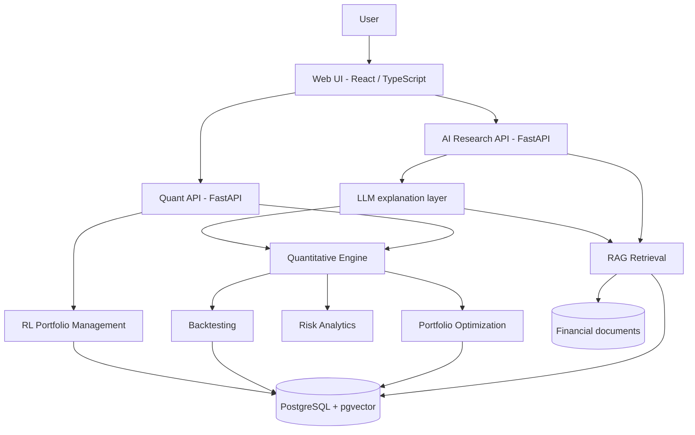
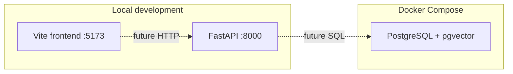

# System Architecture

Portfolio Master is a modular-monolith investment research platform. It is built so that
deterministic finance, sequential decision-making, document retrieval, language-model
explanation, and user interface remain separate systems with explicit contracts.

This document describes the **target architecture**. Stage 1A implements the repository,
configuration, API shell, frontend shell, and PostgreSQL/pgvector infrastructure only.

## Purpose

The platform will let a researcher:

1. Select a universe of assets and load validated historical market data.
2. Compute returns, risk, and portfolio analytics from a quantitative engine.
3. Construct portfolios with classical optimization.
4. Backtest strategies under chronological constraints.
5. Train and evaluate a reinforcement-learning portfolio agent against classical benchmarks.
6. Retrieve financial documents and ask an investment-research copilot to explain results.
7. Interact with portfolio weights through a professional web UI.

The platform is a research and engineering system. Historical backtests are simulations.
They are not live performance and they do not guarantee future results.

## Source-of-truth contract

| Concern | Source of truth | Must not |
| --- | --- | --- |
| Quantitative metrics (returns, volatility, Sharpe, VaR, weights from an optimizer) | Quantitative engine | Be invented or overridden by the LLM |
| Sequential allocation policy | RL agent, evaluated empirically | Be assumed superior to classical methods |
| Document evidence | RAG retrieval | Silently mix in uncited model knowledge as fact |
| Explanation and synthesis | LLM, conditioned on engine outputs + retrieved chunks | Modify weights or fabricate numbers |
| Presentation | Frontend | Perform financial calculations itself |

If a user asks "why is this portfolio risky?", the answer is assembled as:

1. **Quantitative evidence** from the risk and portfolio engines.
2. **Qualitative research** from retrieved documents.
3. **Explanation** from the LLM that labels those two sources separately.

## Logical architecture



The two API surfaces are **logical**. They run in one FastAPI application in this project.
Splitting them into separate services is not justified at this scale.

## Runtime architecture (Stage 1A)



Stage 1A wires the processes and configuration. It does not create application tables,
ingest market data, or connect the UI to live portfolio state.

## Layer map

```
USER
  -> Professional web UI
       -> FastAPI application
            -> /health and /api/* routers
            -> Quantitative packages (quant, portfolio, risk, optimization, backtest)
            -> RL package
            -> RAG + LLM packages
            -> PostgreSQL + pgvector
```

## Backend architecture

The backend is a single Python package (`backend/app`) with domain packages rather than
microservices.

| Package | Responsibility | Stage 1A state |
| --- | --- | --- |
| `api` | HTTP routers and OpenAPI surface | Health namespace only |
| `core` | Settings, paths, shared constants | Implemented |
| `schemas` | Request/response models | System schemas only |
| `models` | Persistence entities | Stub |
| `database` | Engine, sessions, migrations hook | Stub |
| `services` | Use-case orchestration | Stub |
| `data` | Market-data ingestion and validation | Stub |
| `quant` | Returns and statistical primitives | Stub |
| `portfolio` | Holdings and weight representation | Stub |
| `risk` | Risk metrics independent of the optimizer | Stub |
| `optimization` | Classical portfolio construction | Stub |
| `backtest` | Chronological simulation | Stub |
| `rl` | Environment, agent, evaluation | Stub |
| `rag` | Ingest, chunk, retrieve | Stub |
| `llm` | Explanation over retrieved + calculated context | Stub |

FastAPI is the HTTP boundary. Domain packages must remain importable in tests without a
running server.

## Frontend architecture

`frontend/` is a Vite + React + TypeScript application. Stage 1A is a professional shell
only. Future routes should map to product areas:

- Dashboard / portfolio overview
- Asset universe
- Portfolio builder
- Optimization
- Risk analytics
- Efficient frontier
- Backtesting
- RL portfolio manager
- Investment research copilot
- Document research
- Reports
- Settings

The UI must call APIs for calculations. It must not reimplement covariance, VaR, or
optimization in the browser except for trivial display formatting.

## Quantitative engine boundaries

`quant`, `portfolio`, `risk`, and `optimization` are deterministic given their inputs.

- **quant**: returns, moments, covariance/correlation estimates.
- **portfolio**: holdings, weights, cash, constraints as data.
- **risk**: volatility, drawdown, VaR/CVaR, risk contribution. Independent of how weights
  were chosen.
- **optimization**: mean-variance, risk parity, constrained solvers.

Assumptions (estimation windows, covariance shrinkage, risk-free rate, long-only
constraints) must be explicit parameters, not hidden defaults buried in the UI.

## Backtesting architecture

The backtester applies a strategy to historical data with:

- initial capital, rebalancing calendar, transaction costs, slippage, cash
- strict as-of information sets
- train / validation / test chronological splits for any fitted method, including RL

Look-ahead bias is treated as a defect, not a modelling choice.

## Reinforcement-learning architecture

RL is a sequential decision problem: state → action → environment → reward.

It is evaluated out of sample against classical benchmarks (equal weight, minimum
volatility, maximum Sharpe, risk parity if implemented). The platform must not assume RL
is superior.

Stage 1A does not include an environment or an agent.

## RAG and LLM architecture

RAG owns document ingest, chunking, embeddings, and retrieval (PostgreSQL + pgvector).

The LLM owns summarization and question answering **over supplied context**:

- quantitative JSON from the engine
- retrieved chunks with metadata and citations

The LLM must refuse to present unsupported financial facts as retrieved evidence.
RAG must never write portfolio weights.

## Database architecture

PostgreSQL is the system of record. pgvector is used later for document embeddings so that
a second vector database is unnecessary.

Stage 1A runs PostgreSQL + pgvector in Docker Compose. No application schema is created
yet. Intended future entities include portfolios, holdings, optimization runs, backtests,
RL experiments, documents, chunks, and research queries.

Authentication tables are deferred.

## API architecture

Public HTTP:

- `GET /` platform metadata
- `GET /health` process liveness (also used by tooling)
- `GET /api/health` API-namespace liveness
- Future domain routes under `/api/...` (assets, portfolio, risk, backtest, rl, research)

OpenAPI is generated by FastAPI at `/docs` and `/openapi.json`.

WebSockets are reserved for long-running jobs (RL training progress, large backtests).
They are not used in Stage 1A.

## Testing architecture

```
backend/tests/
  unit/          fast tests of functions and HTTP foundation
  integration/   API + database when those exist
  leakage/       chronological / look-ahead / document-date tests
  fixtures/      shared data fixtures
```

pytest is the runner. Quantitative stages must add tests for formulas, constraints,
transaction costs, and data leakage **before** treating a module as complete.

## What Stage 1A deliberately excludes

Market-data ingestion, optimization, risk formulas, backtests, RL, embeddings, RAG, LLM
calls, authentication, WebSockets, Redis, Celery, Kubernetes, and a full dashboard.
